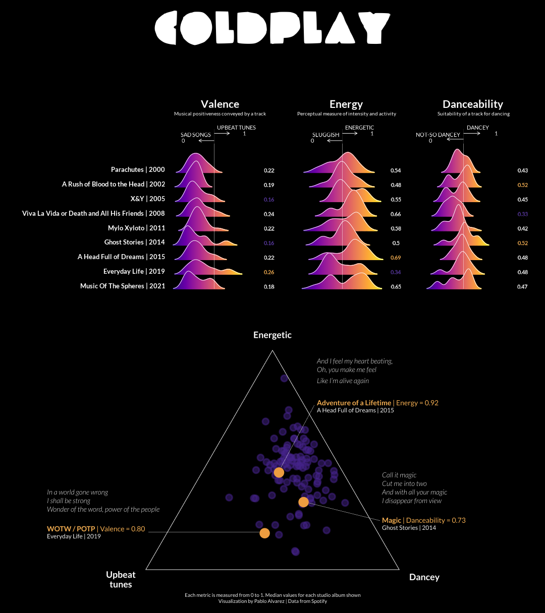

# standalone-charts
A collection of standalone charts for practicing my data visualization skills

This visualization shows three Spotify metrics for the band Coldplay, a band that I believe (and that data backs up) embodies positivity, energy, and happiness.

🚀 𝗡𝗲𝗲𝗱 𝗮 𝗺𝗼𝗼𝗱 𝗹𝗶𝗳𝘁? Listen to the studio album Everyday Life 

⚡️𝗡𝗲𝗲𝗱 𝘁𝗼 𝗹𝗲𝘁 𝗼𝗳𝗳 𝘀𝗼𝗺𝗲 𝘀𝘁𝗲𝗮𝗺? Listen to A Head Full of Dreams, especially Adventure of a Lifetime!

🕺🏼 𝗪𝗮𝗻𝗻𝗮 𝗱𝗮𝗻𝗰𝗲? Listen to A Rush of Blood to the Head and Ghost Stories!

